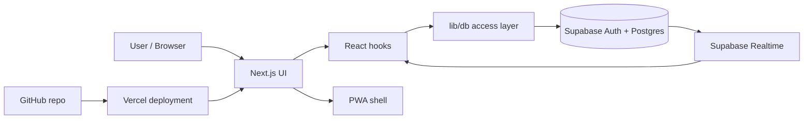

# Taskboard

[](https://github.com/Daniel-Sievers/taskboard/actions/workflows/ci.yml)

A private, installable taskboard app for daily lists, multiple boards, drag & drop planning, realtime sync and manual data ownership.

**Live demo:** https://taskboard-ten-steel.vercel.app/demo  
**Live app:** https://taskboard-ten-steel.vercel.app  
**Repository:** https://github.com/Daniel-Sievers/taskboard

> Personal portfolio / learning project. The public demo can be tested without login; private board data is only visible after authentication.

---

## Why I built this

I wanted a taskboard that opens directly into my workflow, works across devices, keeps a clean dark interface, and gives me more control over my task data than the taskboard extension I used before.

The goal was not to build a generic todo tutorial. The goal was to build a practical private productivity tool with real-world concerns:

- authentication and private data
- online sync across devices
- multiple boards and daily lists
- drag & drop sorting
- mobile-friendly touch behavior
- installable PWA behavior
- manual backup/export/import
- a documented roadmap and development story

---

## Screenshots

### Board overview


### Light mode and color themes


### Task editing


### Settings


### Backup and export


### Responsive drawer / mobile layout


### PWA / installable app


> Before making the repository public, screenshots should be reviewed so they do not show private tasks, personal e-mail addresses, private project names or real user data.

---

## Demo

The public demo opens a local, anonymized demo board without requiring a Magic Link login:

```txt
https://taskboard-ten-steel.vercel.app/demo
```

What can be tested immediately:

1. Open the demo board.
2. Create and edit tasks.
3. Change priority, date, labels and recurrence.
4. Drag tasks between day lists.
5. Complete a recurring task and see the next instance.
6. Switch between day-list and horizontal views.
7. Open details, filters and board actions through the sidebar/hamburger menu.

Demo changes are intentionally not saved to Supabase. They are local to the browser session and may reset when the page reloads. Private boards still require authentication.

---

## Current status

Taskboard is currently usable as a private online taskboard with Supabase authentication, Supabase persistence, realtime sync and Vercel deployment.

Implemented so far:

- Supabase Auth with Magic Link works locally and online.
- Boards, lists and tasks are stored in Supabase.
- Multiple boards can be created, switched, renamed, archived and restored.
- Lists can be created, renamed, deleted and reordered.
- Tasks can be created, edited, completed, soft-deleted, restored and reordered.
- Drag & drop is implemented with `@dnd-kit`.
- Mobile touch drag uses long-press behavior so normal scrolling stays usable.
- Horizontal view supports swipeable list columns.
- Board controls are collapsible and mirrored in the hamburger/sidebar menu.
- Realtime sync v1 was tested online across devices.
- Recurring tasks v1 can create the next scheduled instance after completion.
- Future scheduled tasks are visually quieter until their due date.
- Search, filters, labels and a today-focused view foundation are available.
- Settings include theme, language, accent color, week start, default view, sound effects, delete confirmation and task counts.
- PWA basics are implemented: manifest, icons, start URL and installable app mode.
- JSON backup, JSON import, CSV export, trash recovery and archive management are available.
- GitHub and Vercel deployment are set up.
- A public demo route is available at `/demo` without login.
- A GitHub Actions CI workflow installs dependencies, typechecks and builds the app.

The app is still under active development.

---

## Feature overview

### Core taskboard

- Create, edit, complete and delete tasks
- Add and edit tasks in a modal instead of inline expansion
- Desktop: compact centered editor dialog
- Mobile: app-like near-fullscreen editor dialog
- Optional field chips for notes, date, priority, recurrence, labels and sensitive marking
- Create, rename, delete and reorder lists
- Multiple boards
- Board switching through sidebar and header chips
- Collapsible board control header for a cleaner default view
- Hamburger/sidebar access to day lists, horizontal view, details, filters and board actions
- Soft-delete behavior for tasks
- Optional delete confirmation
- Separate completion and delete sound settings
- Completed task counts
- Compact task rows
- Emoji-friendly and long-text-friendly task titles

### Drag & drop

- Drag tasks within a list
- Drag tasks between lists
- Drag entire lists
- Auto-scroll while dragging
- Saved order through Supabase
- Keyboard sensor support through `@dnd-kit`
- Mobile long-press behavior for touch devices

### Realtime sync

- Supabase Realtime subscriptions for boards, lists and tasks
- Live-Sync status indicator in the board header
- Updates appear on another open device/browser without manual reload
- Manual refresh remains available as a fallback

### Recurring tasks

- No recurrence
- Daily recurrence
- Weekly recurrence
- Monthly recurrence
- Every X days
- Next task instance is created when a recurring task is completed
- Future scheduled tasks can be edited/deleted but are visually less prominent until due

### Search, filters and labels

- Search by task title
- Search by notes
- Search by labels/tags
- Filter by status
- Filter by priority
- Filter by label
- Today-focused view foundation

### Settings

- Dark / light / system theme
- Multiple accent color modes
- German / English UI language foundation
- Week-start setting
- Default view setting
- Separate completion and delete sound toggles
- Delete confirmation toggle
- Task count visibility toggle

### Data management

- JSON backup
- JSON import
- CSV export
- View deleted tasks
- Restore deleted tasks
- Permanently delete individual deleted tasks
- Empty trash
- View archived boards
- Restore archived boards
- Permanently delete archived boards
- Approximate storage usage display

### PWA

- Installable app experience
- Custom app icon
- Manifest configured
- Start URL configured for `/board`
- Portrait orientation preference
- Browser app and PWA usage

---

## Tech stack

| Area | Technology |
| --- | --- |
| App framework | Next.js App Router |
| Language | TypeScript |
| Styling | Tailwind CSS |
| Auth | Supabase Auth |
| Database | Supabase PostgreSQL |
| Realtime | Supabase Realtime |
| Hosting | Vercel |
| Drag & drop | `@dnd-kit` |
| Icons | Lucide React |
| PWA | Web manifest + service worker foundation |
| CI | GitHub Actions |

---

## Architecture

The project separates UI, hooks, database access, preferences and documentation.

```txt
app/
  board/
  login/
  settings/

components/
  app-shell/
  board/
  settings/
  pwa/
  ui/

hooks/
  useAuth.ts
  useTaskboard.ts
  usePreferences.ts
  useI18n.ts

lib/
  db/
  supabase/
  preferences.ts
  i18n.ts
  sound.ts
  dates/

supabase/
  migrations/

docs/
  screenshots/
  ARCHITECTURE.md
  DATABASE.md
  DEVELOPMENT_LOG.md
  NEXT_STEPS.md
  ROADMAP.md
  SECURITY.md
```

High-level flow:



More details:

```txt
docs/ARCHITECTURE.md
docs/DATABASE.md
docs/SECURITY.md
docs/REALTIME_SYNC.md
docs/CI.md
```

---

## Local development

Clone the repository:

```bash
git clone https://github.com/Daniel-Sievers/taskboard.git
cd taskboard
```

Install dependencies:

```bash
npm install
```

Create an environment file:

```bash
cp .env.example .env.local
```

On Windows PowerShell:

```powershell
copy .env.example .env.local
```

Add your Supabase environment variables to `.env.local`:

```env
NEXT_PUBLIC_SUPABASE_URL=https://your-project.supabase.co
NEXT_PUBLIC_SUPABASE_PUBLISHABLE_KEY=your-supabase-publishable-key
NEXT_PUBLIC_SITE_URL=http://localhost:3000
```

The app also supports the older variable name:

```env
NEXT_PUBLIC_SUPABASE_ANON_KEY=your-supabase-anon-key
```

Start the development server:

```bash
npm run dev
```

Open:

```txt
http://localhost:3000/board
```

Important:

```txt
Do not commit .env.local.
Do not commit node_modules.
Do not commit .next.
Do not commit .vercel.
Only .env.example belongs in the repository.
```

---

## Environment variables

Required locally and in Vercel:

```env
NEXT_PUBLIC_SUPABASE_URL=your-supabase-project-url
NEXT_PUBLIC_SUPABASE_PUBLISHABLE_KEY=your-supabase-publishable-key
NEXT_PUBLIC_SITE_URL=https://taskboard-ten-steel.vercel.app
```

Alternative supported key name:

```env
NEXT_PUBLIC_SUPABASE_ANON_KEY=your-supabase-anon-key
```

Never expose or commit Supabase secret keys or service role keys.

---

## Deployment

The app is deployed with Vercel.

Main deployment URL:

```txt
https://taskboard-ten-steel.vercel.app
```

Vercel hosts the app. The data is stored in Supabase.

For production deployment, the following environment variables are needed in Vercel:

```env
NEXT_PUBLIC_SUPABASE_URL=your-supabase-project-url
NEXT_PUBLIC_SUPABASE_PUBLISHABLE_KEY=your-supabase-publishable-key
NEXT_PUBLIC_SITE_URL=https://taskboard-ten-steel.vercel.app
```

Supabase Auth redirect URLs should include:

```txt
https://taskboard-ten-steel.vercel.app/**
http://localhost:3000/**
```

Deployment notes:

```txt
docs/VERCEL_DEPLOYMENT.md
```

---

## Database

The database is managed through Supabase migrations.

Main entities:

- `profiles`
- `boards`
- `lists`
- `tasks`
- `task_versions`

The app uses Row Level Security so users can only access their own boards, lists and tasks.

Additional migrations enable realtime sync, recurring task fields and supporting auth helpers.

Database notes:

```txt
docs/DATABASE.md
supabase/migrations/
```

---

## Build and quality checks

Local build check:

```bash
npm run build
```

Typecheck:

```bash
npm run typecheck
```

The repository also includes a GitHub Actions workflow:

```txt
.github/workflows/ci.yml
```

It runs dependency installation, typechecking and production build checks on pushes and pull requests.

A key dependency-management learning from this project: do not use `latest` blindly for framework dependencies. Next.js is pinned to a patched 15.x version so local and Vercel builds remain reproducible and Vercel does not block deployment due to a vulnerable framework version.

---

## Documentation

Additional implementation notes are stored in `docs/`:

- `docs/ARCHITECTURE.md`
- `docs/CI.md`
- `docs/DATABASE.md`
- `docs/DEVELOPMENT_LOG.md`
- `docs/DRAG_AND_DROP.md`
- `docs/GITHUB_PORTFOLIO.md`
- `docs/NEXT_STEPS.md`
- `docs/ROADMAP.md`
- `docs/KNOWN_LIMITS.md`
- `docs/PWA_INSTALLATION.md`
- `docs/REALTIME_SYNC.md`
- `docs/RECURRING_TASKS.md`
- `docs/TRASH_ARCHIVE.md`
- `docs/SECURITY.md`
- `docs/SUPABASE_SETUP.md`
- `docs/VERCEL_DEPLOYMENT.md`

---

## Development story

This project was built iteratively in focused packages:

1. Initial Next.js / TypeScript / Tailwind project setup
2. Supabase authentication and database connection
3. Online task storage
4. Boards, lists and tasks
5. Drag & drop with saved ordering
6. Responsive sidebar and mobile drawer
7. Search, filters and labels
8. PWA setup and custom app icon
9. Backup, export and import tools
10. Theme, color and language settings
11. GitHub and Vercel deployment
12. Realtime sync across devices
13. Mobile touch and horizontal view polish
14. Trash and archive management
15. Recurring tasks
16. Collapsible board controls and sidebar actions
17. Portfolio README and documentation polish
18. Public demo access without login

Detailed log:

```txt
docs/DEVELOPMENT_LOG.md
```

---

## Known limits

The project is intentionally still evolving. Current known limits include:

- Magic Link email delivery can hit provider/free-plan rate limits during heavy testing.
- Offline sync is not implemented yet.
- Push notifications are not implemented yet.
- Realtime sync v1 refreshes board data rather than applying every remote event locally in a granular way.
- Recurring tasks are implemented as a first version and may need more series-management controls later.
- Browser/PWA icon behavior can differ between Chrome, Edge, Firefox and mobile platforms.
- Public demo data is anonymized; README screenshots should still be reviewed before a public portfolio release.

More detail:

```txt
docs/KNOWN_LIMITS.md
```

---

## Roadmap

Planned improvements:

- Automatic date recognition from manual list titles
- More complete mobile carousel behavior
- More robust realtime sync status and reconnect behavior
- Push notification planning
- Optional custom SMTP for Magic Links
- Offline sync with IndexedDB
- Optional client-side encryption for sensitive tasks
- Optional demo video/GIF for the portfolio README

More detail:

```txt
docs/ROADMAP.md
docs/NEXT_STEPS.md
```

---

## What I learned

This project helped me practice:

- building a real-world app with Next.js and TypeScript
- working with Supabase Auth, Row Level Security and Realtime
- structuring a frontend project for maintainability
- implementing drag & drop interactions with `@dnd-kit`
- designing mobile touch interactions
- deploying through GitHub and Vercel
- handling environment variables safely
- working through framework version and deployment issues
- pinning dependencies for reproducible builds
- designing around sync, backups, privacy and UX details
- documenting an iterative development process

---

## License

This is currently a personal portfolio / learning project.
