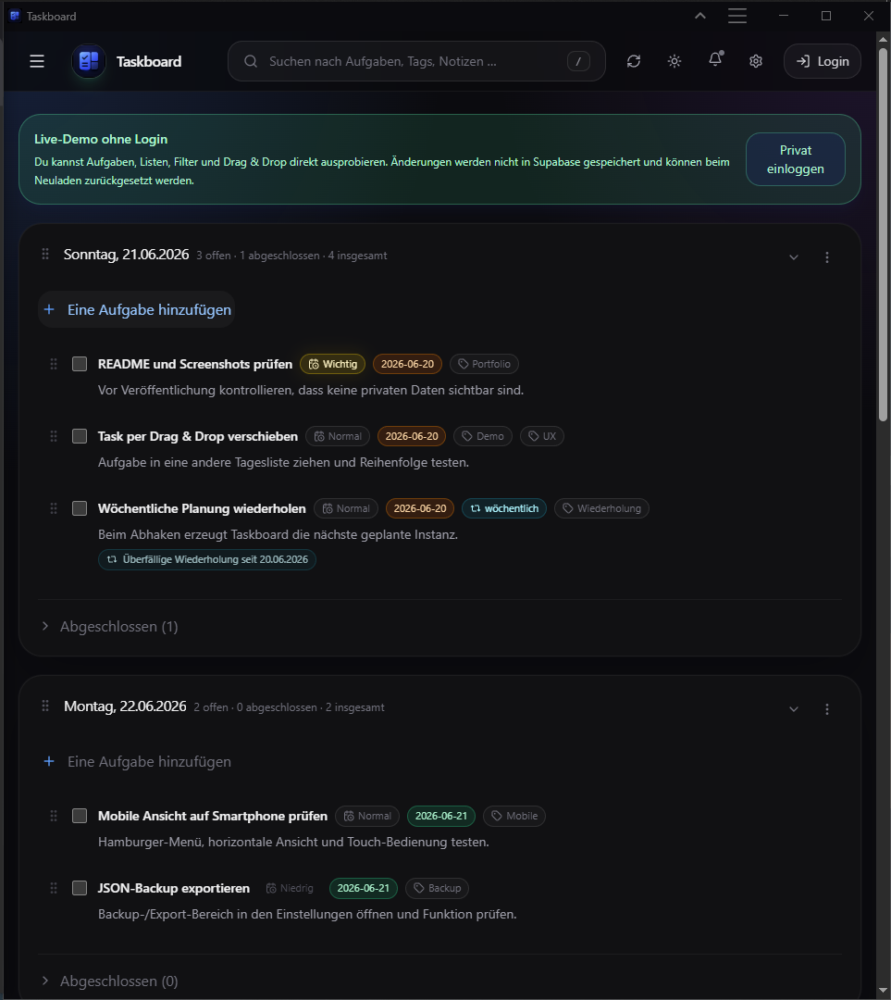
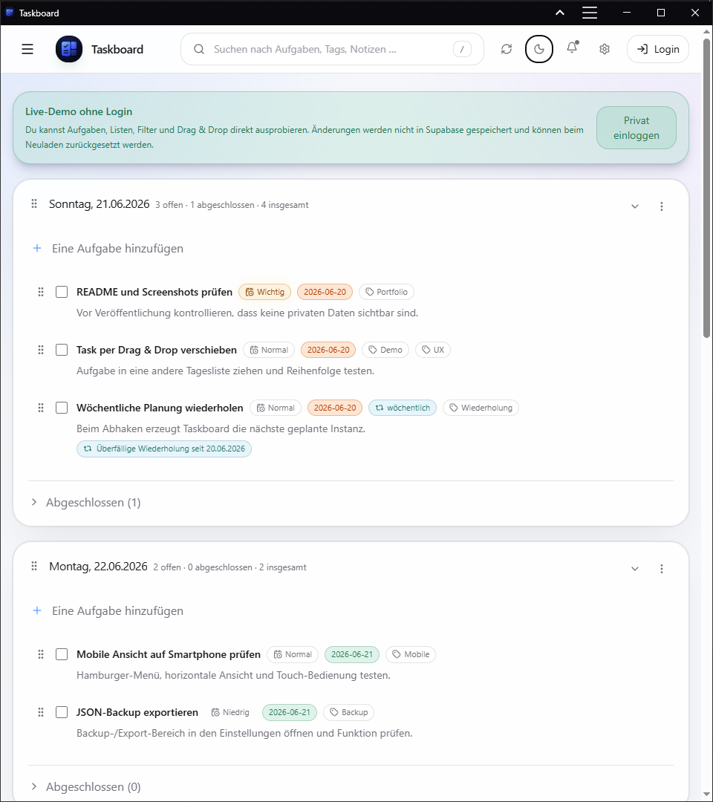
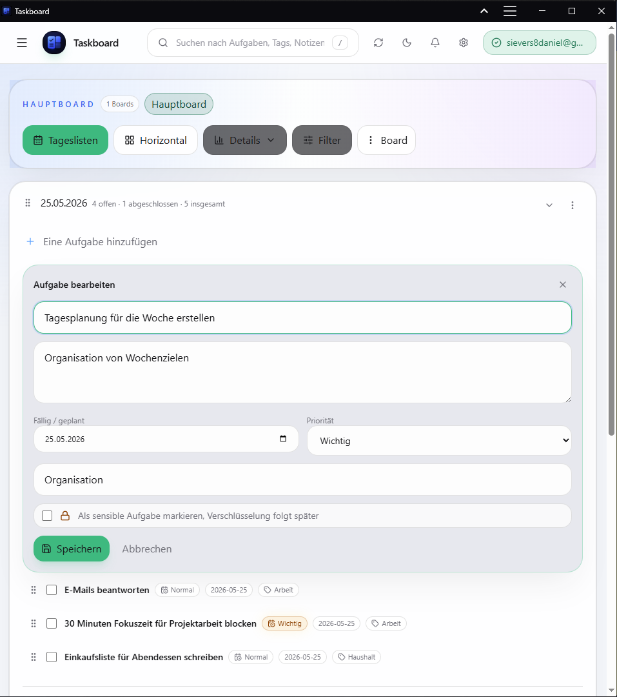
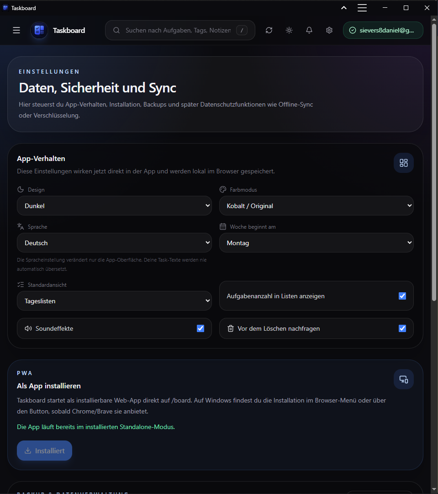
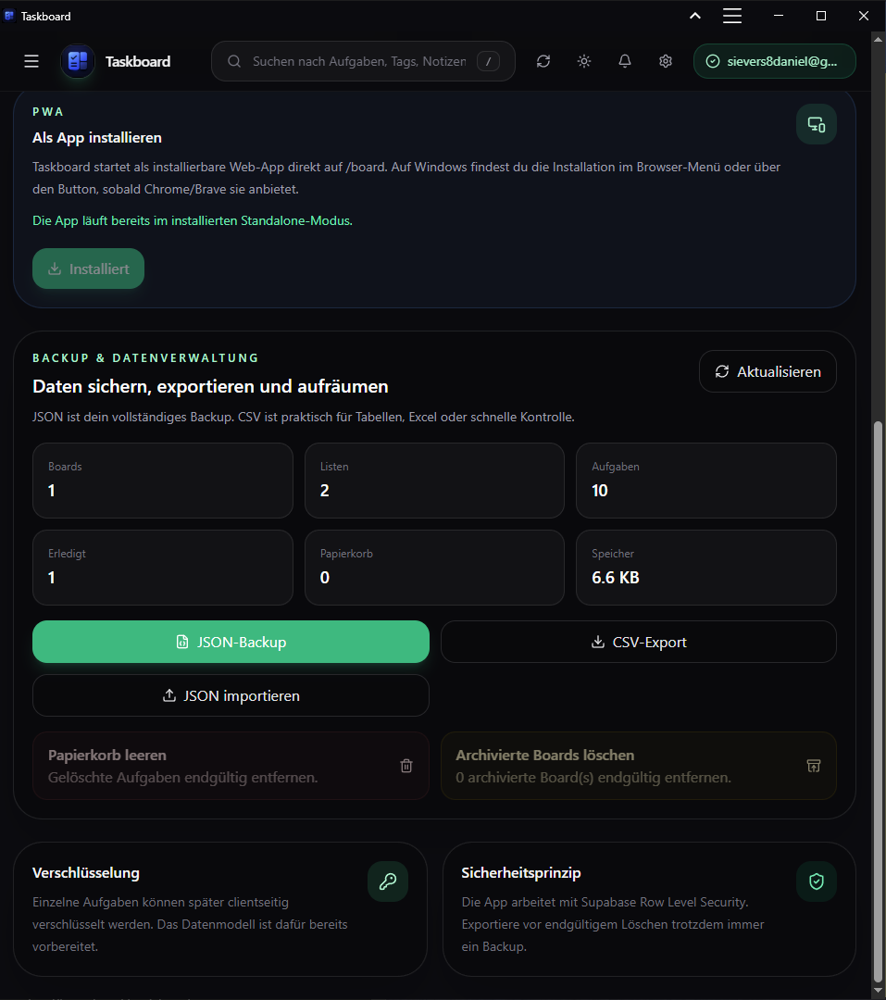
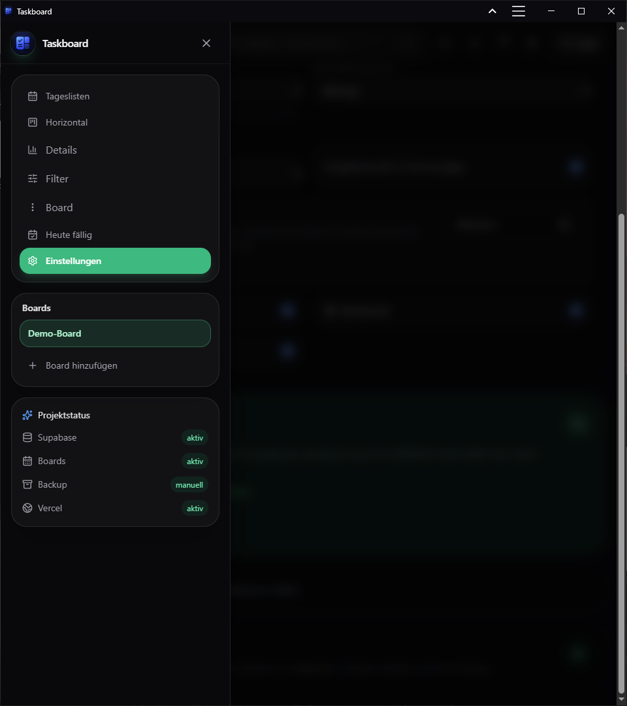
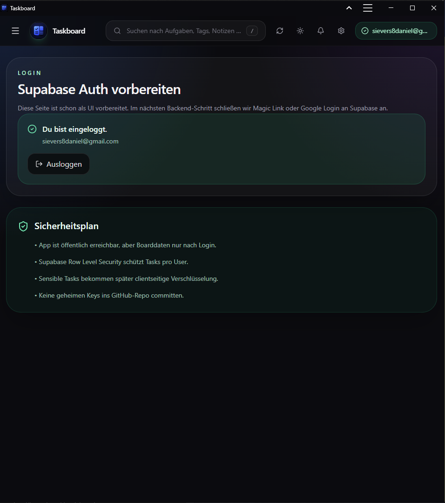
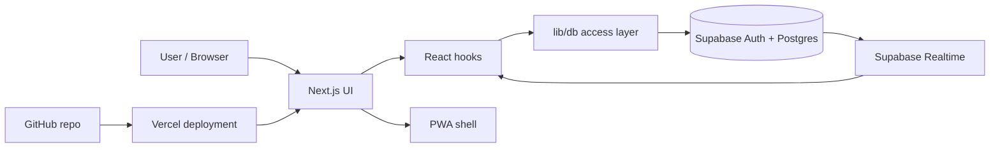

# Taskboard

[](https://github.com/Daniel-Sievers/taskboard/actions/workflows/ci.yml)

Taskboard is a private, installable task planning app built with Next.js, TypeScript and Supabase. It combines daily lists, multiple boards, drag & drop planning, recurring tasks, realtime sync, PWA support and manual data export in one focused productivity interface.

**Public demo:** https://taskboard-ten-steel.vercel.app/demo  
**Live app:** https://taskboard-ten-steel.vercel.app  
**Repository:** https://github.com/Daniel-Sievers/taskboard

The public demo uses anonymized local data and works without login. Authenticated boards use Supabase Auth, Supabase PostgreSQL and Row Level Security.

---

## Why I built this

The initial trigger for Taskboard was a workflow change in the taskboard extension I used before. After an update, the extension no longer opened directly into my board, but first showed a start/overview page. Reaching the actual board took extra clicks every time. That small friction was enough to make me build a taskboard that opens directly into the workflow I wanted. The original extension later improved this behavior again, but by then Taskboard had become a useful project of its own.

Taskboard is intentionally more than a todo-list tutorial. It is a practical systems and workflow project with realistic concerns: authentication, persistence, realtime synchronization, mobile interaction, PWA behavior, backup/export, deployment and clear documentation.

The project is not positioned as a claim that I am a professional fullstack developer. Instead, it demonstrates practical technical literacy: working with Git/GitHub, reproducible dependencies, CI checks, Vercel deployment, Supabase Auth, PostgreSQL-backed persistence, Row Level Security, environment variables, documentation and iterative project maintenance.

---

## Screenshots

### Board overview / dark mode



### Light mode



### Task editing



### Settings and notification preparation



### Signed-in data tools

Backup, import, restore and export are available for authenticated Supabase boards and are not part of the local public demo.



### Responsive drawer / mobile layout



### Login and public demo entry



---

## Demo

The demo route opens a local, anonymized board without requiring a Magic Link login:

```txt
https://taskboard-ten-steel.vercel.app/demo
```

Demo mode supports the main review flow: creating and editing tasks, changing priority/date/labels/recurrence, dragging tasks between lists, completing recurring tasks, switching views and opening the settings area.

Demo changes are intentionally not saved to Supabase and can reset after reload. Persistent boards, Supabase sync and full backup/import/restore workflows belong to the authenticated Magic Link mode. This keeps portfolio testing quick while private data remains behind Supabase Auth and Row Level Security.

---

## Current status

Taskboard is usable as a private online taskboard with Supabase authentication, database persistence, realtime sync, signed-in data-management tools and Vercel deployment.

Implemented highlights:

- Magic Link authentication with Supabase Auth
- Supabase PostgreSQL persistence with Row Level Security
- Multiple boards with archive/restore behavior
- Manual lists, date-aware lists and automatic routing for dated tasks
- Task creation/editing in a modal with notes, priority, labels, recurrence and date fields
- Drag & drop for tasks and lists with saved ordering
- Mobile long-press drag behavior and a horizontal list view
- Search, filters, labels and a today-focused foundation
- Recurring tasks with daily, weekly, monthly and custom interval rules
- Trash recovery, archived board management and permanent cleanup actions
- Theme, accent color, language, week-start, sound and view preferences
- Browser-notification permission preparation with honest status handling
- JSON backup/import and CSV export for authenticated boards
- PWA manifest, icons, installable app mode and demo shortcut
- Public demo route without login
- GitHub Actions build check and Vercel deployment

---

## Feature overview

### Core taskboard

- Create, edit, complete, soft-delete and restore tasks
- Create, rename, delete and reorder lists
- Create, switch, rename, archive, restore and delete boards
- Recognize date lists from titles such as `Dienstag, 26.05.2026` or `26.05.2026`
- Route open dated tasks into matching manual date lists when they exist
- Move older open tasks into an `Offen` list
- Collapse advanced board controls for a cleaner default view
- Access board actions through header controls and the sidebar/hamburger menu

### Task editing

- Modal-based editor on desktop and mobile
- Optional fields for notes, date, priority, recurrence and labels
- Completion/delete sound effects with separate settings
- Optional delete confirmation
- Completed-task counts
- Compact task rows with support for long titles and emoji

### Drag & drop

- Reorder tasks within a list
- Move tasks between lists
- Reorder entire lists
- Auto-scroll during drag operations
- Keyboard sensor support through `@dnd-kit`
- Touch-friendly long-press behavior on mobile devices

### Realtime sync

- Supabase Realtime subscriptions for boards, lists and tasks
- Live-sync status indicator in the board header
- Updates appear in another browser/device without manual reload
- Manual refresh remains available as a fallback

### Recurring tasks

- No recurrence, daily, weekly, monthly and every-X-days rules
- Next open instance is created when a recurring task is completed
- Duplicate next instances are avoided
- Future scheduled tasks remain visible but visually quieter until due
- Recurrence can be changed or stopped from the task modal

### Search, filters and labels

- Search by title, notes and labels
- Filter by status, priority and label
- Compact active-filter summary
- Today-focused view foundation

### Settings and data ownership

- Dark, light and system theme modes
- Multiple accent color modes
- German/English language foundation
- Week-start and default-view preferences
- Notification permission preparation
- JSON backup/import and CSV export for authenticated boards
- Trash recovery and archive management
- Approximate storage usage display

### PWA

- Installable app experience
- Custom icons and maskable icons
- Web manifest and service worker foundation
- Start URL for the private board
- Demo shortcut for portfolio testing

---

## Tech stack

| Area | Technology |
| --- | --- |
| App framework | Next.js App Router |
| Language | TypeScript |
| Styling | Tailwind CSS |
| Auth | Supabase Auth |
| Database | Supabase PostgreSQL |
| Realtime | Supabase Realtime |
| Hosting | Vercel |
| Drag & drop | `@dnd-kit` |
| Icons | Lucide React |
| PWA | Web manifest + service worker foundation |
| CI | GitHub Actions |

---

## Architecture

The project separates routing, UI components, hooks, database access, preferences and documentation.

```txt
app/
  board/
  demo/
  login/
  settings/

components/
  app-shell/
  board/
  settings/
  pwa/
  ui/

hooks/
  useAuth.ts
  useTaskboard.ts
  usePreferences.ts
  useI18n.ts

lib/
  db/
  supabase/
  dates/
  preferences.ts
  i18n.ts
  notifications.ts
  sound.ts

supabase/
  migrations/

docs/
  screenshots/
```



More details are documented in `docs/ARCHITECTURE.md`, `docs/DATABASE.md`, `docs/SECURITY.md`, `docs/REALTIME_SYNC.md` and `docs/DATE_AUTOMATION.md`.

---

## Local development

```bash
git clone https://github.com/Daniel-Sievers/taskboard.git
cd taskboard
npm ci
cp .env.example .env.local
npm run dev
```

PowerShell alternative for the environment file:

```powershell
copy .env.example .env.local
```

Required local environment variables:

```env
NEXT_PUBLIC_SUPABASE_URL=https://your-project.supabase.co
NEXT_PUBLIC_SUPABASE_PUBLISHABLE_KEY=your-supabase-publishable-key
NEXT_PUBLIC_SITE_URL=http://localhost:3000
```

The app also supports the older client-key variable name:

```env
NEXT_PUBLIC_SUPABASE_ANON_KEY=your-supabase-anon-key
```

The development server runs at:

```txt
http://localhost:3000/board
```

Only `.env.example` belongs in the repository. Local `.env.local`, `.next`, `node_modules`, `.vercel` and TypeScript build-info files stay untracked.

---

## Environment variables

Required locally and in Vercel:

```env
NEXT_PUBLIC_SUPABASE_URL=your-supabase-project-url
NEXT_PUBLIC_SUPABASE_PUBLISHABLE_KEY=your-supabase-publishable-key
NEXT_PUBLIC_SITE_URL=https://taskboard-ten-steel.vercel.app
```

Alternative supported key name:

```env
NEXT_PUBLIC_SUPABASE_ANON_KEY=your-supabase-anon-key
```

Supabase secret keys and service-role keys are intentionally not used in the frontend.

---

## Deployment

Taskboard is deployed with Vercel. Supabase remains the data backend.

Main deployment URL:

```txt
https://taskboard-ten-steel.vercel.app
```

Public review URL:

```txt
https://taskboard-ten-steel.vercel.app/demo
```

Production environment variables are configured in Vercel:

```env
NEXT_PUBLIC_SUPABASE_URL=your-supabase-project-url
NEXT_PUBLIC_SUPABASE_PUBLISHABLE_KEY=your-supabase-publishable-key
NEXT_PUBLIC_SITE_URL=https://taskboard-ten-steel.vercel.app
```

Supabase Auth redirect URLs include the Vercel deployment and local development URL:

```txt
https://taskboard-ten-steel.vercel.app/**
http://localhost:3000/**
```

Deployment details are documented in `docs/VERCEL_DEPLOYMENT.md`.

---

## Database and security

The database is managed through Supabase migrations in `supabase/migrations/`.

Main entities:

- `profiles`
- `boards`
- `lists`
- `tasks`
- `task_versions`

The app uses Row Level Security so authenticated users can only access their own boards, lists and tasks. The frontend uses public Supabase client keys only.

More details are documented in `docs/DATABASE.md` and `docs/SECURITY.md`.

---

## Build and quality checks

Local checks:

```bash
npm run typecheck
npm run build
```

The repository includes a GitHub Actions workflow at `.github/workflows/ci.yml`. It installs dependencies with `npm ci`, runs the TypeScript check and verifies the production build.

---

## Documentation

Additional implementation notes are stored in `docs/`:

- `docs/ARCHITECTURE.md`
- `docs/DATABASE.md`
- `docs/SECURITY.md`
- `docs/DATE_AUTOMATION.md`
- `docs/DRAG_AND_DROP.md`
- `docs/REALTIME_SYNC.md`
- `docs/RECURRING_TASKS.md`
- `docs/NOTIFICATIONS.md`
- `docs/PWA_INSTALLATION.md`
- `docs/BACKUP_EXPORT.md`
- `docs/KNOWN_LIMITS.md`
- `docs/ROADMAP.md`
- `docs/DEVELOPMENT_LOG.md`

---

## Development story

Taskboard was built iteratively in focused packages: initial setup, Supabase auth and persistence, boards/lists/tasks, drag & drop, responsive navigation, filters/labels, PWA support, backup/export, settings, realtime sync, mobile polish, trash/archive management, recurring tasks, public demo access, date automation and notification preparation.

The detailed development log is in `docs/DEVELOPMENT_LOG.md`.

---

## Known limits

Current limits are documented rather than hidden:

- Magic Link email delivery can hit provider/free-plan rate limits during heavy testing.
- Offline sync is not implemented yet.
- Browser notification permission and settings are prepared; automatic server-side push reminders are not implemented yet.
- Realtime sync v1 refreshes board data rather than applying every remote event locally in a granular way.
- Recurring tasks cover the main repeat patterns, but advanced series management remains future work.
- Browser/PWA icon behavior can differ between platforms.
- The public demo does not persist changes to Supabase; backup/import/restore is intended for authenticated boards.

More detail is documented in `docs/KNOWN_LIMITS.md`.

---

## Roadmap

Planned improvements:

- Full Web Push reminder implementation
- More robust realtime reconnect/status handling
- Optional custom SMTP setup for Magic Links, if email delivery limits become relevant
- Offline sync with IndexedDB
- Optional client-side encryption for sensitive tasks
- More advanced recurring-series controls

More detail is documented in `docs/ROADMAP.md` and `docs/NEXT_STEPS.md`.

---

## What this project demonstrates

Taskboard is a practical learning and portfolio project. Its purpose is not to present advanced software engineering specialization, but to document how I can work through a technical system end to end: understand a workflow problem, build a usable solution with AI-assisted development, connect services, keep a repository organized and debug issues through logs, GitHub Actions and deployment feedback.

The project shows:

- interest in practical code, digital workflows and data-oriented systems
- routine using VS Code, Git, GitHub commits, pushes and repository history
- basic project organization with GitHub Actions, Vercel deployments and Supabase
- responsible handling of environment variables, public keys, private keys and repository hygiene
- a working understanding of authentication, persistent data, Row Level Security and backups
- the ability to use documentation, error messages and AI assistance to solve implementation problems step by step
- careful documentation of setup, architecture, limitations and future improvements
- a broader interest in data work, including SQL/PostgreSQL concepts, MySQL, Python and statistics

---

## License

This is currently a personal portfolio / learning project.
