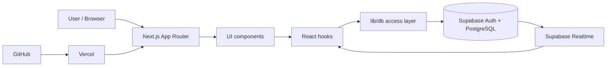

# Architecture

Taskboard is a Next.js app backed by Supabase Auth, Supabase PostgreSQL and Supabase Realtime. Vercel hosts the frontend. The project is structured so UI, app state, database access and documentation stay separated.

## High-level overview



## Main folders

```txt
app/
  board/
  demo/
  login/
  settings/

components/
  app-shell/
  board/
  settings/
  pwa/
  ui/

hooks/
  useAuth.ts
  useTaskboard.ts
  usePreferences.ts
  useI18n.ts

lib/
  db/
  supabase/
  dates/
  preferences.ts
  i18n.ts
  sound.ts

supabase/
  migrations/

docs/
  screenshots/
```

## Data access principle

UI components should not directly contain Supabase query logic. Database operations are grouped in `lib/db/`.

Example flow:

```txt
components/board/TaskCard.tsx
  -> hooks/useTaskboard.ts
    -> lib/db/tasks.ts
      -> lib/supabase/client.ts
        -> Supabase
```

This makes the app easier to maintain and keeps UI code focused on interaction and presentation.

## State and sync

The public `/demo` route redirects to `/board?demo=1`, which forces `useTaskboard` into local demo mode with anonymized sample data.

The board page receives data through `useTaskboard`. Local UI state handles view mode, filters, active drag state and board controls. Persistent data changes go through Supabase.

Realtime v1 subscribes to relevant table changes and refreshes board data when remote updates arrive.

## Authentication and privacy

Supabase Auth handles login. Row Level Security protects board data so users can only access their own records. The frontend only uses public Supabase client keys. Secret/service-role keys must never be exposed in the app or committed to the repository.

## Deployment

GitHub is the source repository. Vercel deploys from the `main` branch. Supabase stores data separately from Vercel.

```txt
GitHub push
  -> Vercel build
    -> Next.js app deployment
      -> Supabase for auth/data/realtime
```

## Future architecture work

- IndexedDB cache for offline sync
- mutation queue for offline edits
- stronger realtime diff handling
- optional client-side encryption for sensitive tasks
