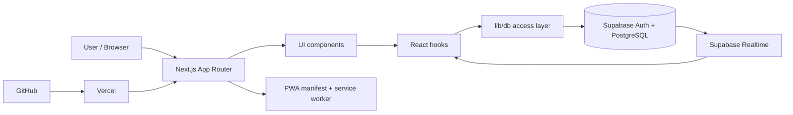

# Architecture

Taskboard is a Next.js App Router application backed by Supabase Auth, Supabase PostgreSQL and Supabase Realtime. Vercel hosts the frontend. The codebase separates routing, UI components, app state, database access, preferences and documentation.

## High-level overview



## Main folders

```txt
app/            Route segments for board, demo, login and settings
components/     App shell, board UI, settings, PWA and shared UI components
hooks/          Auth, board state, preferences and i18n hooks
lib/            Database access, Supabase client, dates, notifications and utilities
supabase/       SQL migrations and seed data
docs/           Architecture notes, feature docs and screenshots
```

## Data flow

UI components call React hooks. Persistent changes are handled through `lib/db/*` modules, which use the Supabase client from `lib/supabase/client.ts`. This keeps Supabase query logic out of presentation components.

```txt
components/board/TaskCard.tsx
  -> hooks/useTaskboard.ts
    -> lib/db/tasks.ts
      -> lib/supabase/client.ts
        -> Supabase
```

## Demo mode

The public `/demo` route redirects to `/board?demo=1`. In this mode, `useTaskboard` uses local anonymized demo data instead of Supabase persistence. This keeps the portfolio demo frictionless while the authenticated app remains private.

## Date automation

Date-like list titles are parsed in `lib/dates/list-dates.ts`. `useTaskboard` uses that helper to route open dated tasks into matching manual date lists and to move older open tasks into an `Offen` list.

## State and sync

The board page receives persistent data through `useTaskboard`. Local UI state handles view mode, filters, active drag state and collapsed controls. Realtime v1 subscribes to relevant table changes and refreshes board data when remote updates arrive.

## Authentication and privacy

Supabase Auth handles login. Row Level Security protects board data so each authenticated user can only access their own records. The frontend uses public Supabase client keys only; service-role keys are not part of the app bundle.

## Notification preparation

Notification settings are implemented in the UI and browser-permission layer. A full push-reminder system would require subscriptions, secure storage, VAPID keys, a server-side send path and scheduled reminder logic.

## Deployment model

GitHub stores the source code. Vercel builds and hosts the frontend. Supabase stores authenticated data independently from Vercel.
